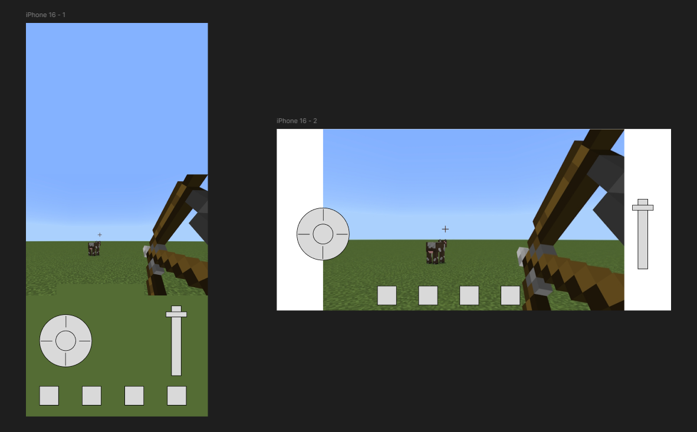

# Bojo Dojo — Game Spec v2

## Overview

Bojo Dojo is a mobile-first multiplayer archery duel. Players spawn at fixed positions on a procedurally generated 3D terrain map and attempt to eliminate each other with bow and arrow. No free movement — all gameplay is aiming, firing, fletching, and reading the battlefield. The core loop is fast, the networking is simple, and the skill ceiling comes from spatial reasoning and shot economy.

**Platform:** Mobile web (PWA), desktop later
**Players:** 1vN (2–6 players, potentially more)
**Perspective:** First-person, stationary, landscape orientation
**Match format:** First to 3 round wins

---

## Core Loop

```
Spawn → Scan for enemies → Aim & shoot → Fletch new arrows → Repeat
```

Each round ends when one player remains or time expires.

---

## Gameplay Mechanics

### Camera & Controls

- **Landscape orientation only** for v1. Portrait support added later
- **Swipe** center of screen for large camera movements (full 360° horizontal, ±90° vertical from eye level)
- **Thumbstick** (left side of screen) for fine/precise aiming adjustments
- **Gyroscope** as opt-in toggle — device orientation controls camera. Default OFF. Player can enable in settings or pre-round menu
- First-person perspective from a fixed spawn point at eye-level standing height on terrain

### HUD Layout (Landscape)

```
┌─────────────────────────────────────────────────┐
│                                                 │
│  [Thumbstick]        +           [Pull Slider]  │
│     (left)       (crosshair)       (right)      │
│                                                 │
│          [ ] [ ] [ ] [ ]  ← inventory slots     │
└─────────────────────────────────────────────────┘
```



- **Left:** Virtual thumbstick for fine aim
- **Center:** Swipeable area for broad camera rotation, crosshair always centered
- **Right:** Vertical slider for bow pull (drag down to draw, release to fire)
- **Bottom center:** Inventory slots showing arrow count, teleport arrow, active pickups
- Bow model visible in first-person, drawn back as the pull slider is engaged (Minecraft-style placement and animation)

### Shooting

- **Pull slider** on right side of screen to draw bow. Pull distance = force/range
- **Trajectory indicator** renders the first ~30% of the arrow's predicted arc (the full trajectory is always computed internally — this matters for the Elven Eyes pickup in v2+)
- **Release** slider to fire
- Aiming is controlled by camera direction (horizontal) + vertical look angle
- Arrows follow a ballistic arc (gravity applies)
- **One-hit kill** (unless target has a shield — see Pickups)

### Arrow Economy

- **Starting arrows:** 5 per round (tuning variable)
- **Fletching:** Quick downward swipe gesture to craft one arrow, ~3 second cooldown/animation before the arrow is available
- **Fletching tradeoff:** While fletching, the camera looks down (~-30° from horizontal). Player cannot scan or shoot — they're heads-down and vulnerable
- **No hard cap** on total arrows — player can fletch indefinitely, but the time cost is real

### Arrow Visibility

- When an arrow lands, **all players** see where it stuck into the terrain
- Arrows are **anonymous** — you can see that an arrow landed, but not who fired it
- In 1v1 this is obvious; in multiplayer it creates fog-of-war confusion
- Your own arrows are visually distinct to you (subtle color/glow) so you can track your shots

### Teleportation Arrow

- **Limited resource:** Start with 1 per round
- Functions like a normal arrow — aim and fire it
- On impact, the player is **teleported to the landing point** and adopts that as their new fixed position
- New position inherits terrain elevation at landing point
- High risk: you land wherever it hits, potentially in the open or near an enemy
- Additional teleport arrows available as map pickups
- **Key interaction with shrinking zone:** If the zone closes past your position, you have **10 seconds** to use a teleport arrow or you die. This punishes camping and rewards early repositioning

### Death

- One arrow hit = elimination (unless shielded)
- On death: transition to **spectator mode**
- **v1 spectator:** Cycle through surviving players' first-person views (tap to switch)
- **v2+ spectator:** Overhead "eye in the sky" free-look camera showing the map, arrows in flight, and player markers

---

## Round Structure

### Timing

- **Base round time:** 90 seconds (tuning variable)
- **Player scaling:** +15 seconds per player beyond 2 (e.g., 4 players = 120s, 6 players = 150s)
- These are starting values — playtest and adjust

### Shrinking Zone

- **Activation:** Kicks in when ~60% of round time has elapsed (e.g., at 54 seconds remaining in a 90s round)
- **Behavior:** Circular safe zone contracts toward a random center point on the map
- **Death timer:** Players outside the zone have **10 seconds** to teleport back in or they die
- **Purpose:** Forces engagement in late-round, prevents stalemates

### Scoring

- **Last player standing** wins the round and earns 1 point
- If time expires with multiple players alive: round is a draw, no points awarded (incentivizes aggression)
- **Match win:** First to 3 points
- Rounds are fast — a full match stays under ~10 minutes

---

## Pickups & Upgrades

Pickups are scattered on the map at fixed positions. Acquiring them requires shooting them with an arrow (you can't walk to them). This adds a skill layer: do you spend an arrow to hit a pickup, or save it for an enemy?

### v1 Pickups

| Pickup | Effect | Visual |
|---|---|---|
| **Shield** | Absorbs one hit, then breaks | Small blue translucent bubble around player. Shatters visibly on impact so the attacker knows it wasn't a bug |
| **Arrow Bundle** | +3 arrows | Quiver icon on terrain |
| **Teleport Arrow** | +1 teleport arrow | Distinct glowing arrow stuck in ground |

### v2+ Pickups

| Pickup | Effect | Visual |
|---|---|---|
| **Fire Arrow** | Arrow leaves a burning AoE on impact. Player inside the fire for 5+ seconds dies | Red flame trail in flight, burning circle on landing |
| **Tracking Arrow** | Arrow curves slightly toward nearest player | Strobe/flashing light in flight |
| **Elven Eyes** | One shot with full trajectory arc rendered (100% path visible instead of 30%) | TBD — probably a glowing eye icon on terrain |

### Pickup Placement Rules

- Pickup positions are **fixed for the entire match** (all rounds in a best-of series use the same map and pickup layout)
- Higher-value pickups (teleport arrows, shields) placed in more **exposed/risky terrain** — you have to reveal your aim direction or spend arrows to reach them
- Placement algorithm should evaluate terrain openness at each candidate position and assign pickup tier accordingly

---

## Map Design

### Procedural Terrain Generation

Maps are **procedurally generated**, not hand-crafted. The same generated map persists for all rounds in a match (up to 5 rounds in a first-to-3 series). A new match generates a new map.

**Terrain generation approach:**
- **Heightmap** generated via layered noise (Perlin/Simplex) with multiple octaves for varied scale
- **Feature parameters:**
  - Overall map size (scales with player count — see Map Scaling below)
  - Elevation range (min/max height delta)
  - Roughness / frequency (controls hill density)
  - Flat zone ratio (ensures some open areas for sightlines alongside cover terrain)
- **Obstacles:** Rocks and trees scattered via Poisson disk sampling on the heightmap, density controlled by parameter
- **Biome feel:** v1 ships with one biome look (grassy hills with rocks and trees). Terrain generation parameters can be tuned to produce different feels later (desert canyon, snowy peaks, etc.)

### Algorithmic Spawn Point Placement

Since terrain is procedural, spawn points must be algorithmically placed each match:

1. Generate candidate positions across the map (grid or random sampling)
2. Filter out invalid positions (too steep, too close to map edge, inside obstacles)
3. For N players, select N positions using **farthest-point sampling** — iteratively pick the point that maximizes minimum distance to all already-selected points
4. Validate that no two selected points have direct line-of-sight (raycast check against terrain heightmap)
5. If validation fails, regenerate candidates and retry (with iteration cap, then fall back to best-effort)

**Minimum spawn distance** scales with map size and player count.

### Algorithmic Pickup Placement

1. Generate candidate positions (separate from spawn points, minimum distance from any spawn)
2. For each candidate, compute an **exposure score** — how visible/open the position is (based on surrounding terrain elevation, lack of nearby obstacles)
3. Assign pickup tiers to positions: high-exposure positions get high-value pickups (shield, teleport arrow), sheltered positions get arrow bundles
4. Select a fixed number of pickup positions per match based on player count

### Map Scaling

Map size adjusts based on player count to maintain gameplay density:
- **2 players:** Smaller map, tighter engagement
- **4 players:** Medium map
- **6 players:** Larger map, more terrain variety
- Specific dimensions are tuning variables — start with a baseline and adjust through playtesting

---

## Technical Architecture

### Why This Is Simpler Than Birdgame

The critical difference: **no continuous movement sync.** The entire game state is:
- Player positions (fixed, only change on teleport)
- Arrow events (origin, direction, force — discrete messages)
- Pickup states (acquired or not)
- Player status (alive/dead/shielded)

This is a message-passing game, not a physics-sync game. No interpolation, no client prediction, no jitter correction.

### Stack

- **Build:** Vite + TypeScript (same as Birdgame — proven, no complaints)
- **Renderer:** Three.js (mobile WebGL)
- **UI/HUD:** HTML overlay on Three.js canvas (arrow count, timer, fletching state, inventory)
- **Networking:** PartyKit (WebSocket-based, deployed on Cloudflare)
- **Hosting model:** One player creates a room, others join via share link or room code
- **Deployment:** GitHub Pages (static frontend) + PartyKit (relay server on Cloudflare free tier)

### Networking Model

**Message types (client → server → clients):**

```
PLAYER_JOINED    { playerId, spawnPoint }
ARROW_FIRED      { playerId, origin, direction, force, arrowType }
ARROW_LANDED     { arrowId, position }  // server broadcasts anonymized
PLAYER_HIT       { targetId, arrowId }  // server validates and broadcasts
PLAYER_TELEPORT  { playerId, newPosition }
PICKUP_ACQUIRED  { pickupId, playerId }
FLETCH_START     { playerId }
FLETCH_COMPLETE  { playerId }
ZONE_UPDATE      { center, radius }     // server broadcasts periodically
ROUND_END        { winnerId, scores }
MAP_SEED         { seed, playerCount }  // sent on match start so all clients generate identical terrain
```

**Server responsibilities:**
- Room management (create/join/leave)
- Map seed generation and distribution
- Spawn point assignment (server runs placement algorithm)
- Hit detection validation (server-authoritative — client sends arrow trajectory, server confirms hit)
- Zone contraction timing
- Score tracking
- Round lifecycle

**Client responsibilities:**
- Terrain generation from seed (deterministic — all clients produce identical terrain from same seed)
- Rendering (terrain, arrows, pickups, effects)
- Input handling (swipe, thumbstick, gyro, fletching gesture, pull slider)
- Trajectory preview calculation (30% of full arc)
- Arrow flight animation (locally computed from ARROW_FIRED parameters)
- Sound/haptics

### Hit Detection

Server-authoritative to prevent cheating:
1. Client fires arrow, sends origin + direction + force
2. Server computes full trajectory using shared physics constants
3. Server checks if trajectory intersects any player hitbox (generous cylinder around player position)
4. If hit: server broadcasts PLAYER_HIT
5. If shield: server broadcasts SHIELD_BROKEN, player survives

Computationally cheap — ballistic arcs against fixed points.

### Mobile Considerations

- **Orientation:** Landscape only for v1
- **Touch targets:** All interactive elements sized for thumbs (min 44px)
- **Performance:** Keep poly count low. Terrain is a heightmap mesh with flat shading. Trees/rocks are low-poly primitives
- **Battery:** 30fps cap. Aggressive draw distance limits
- **Connection:** Works on cellular. Messages are tiny (< 200 bytes each). Tolerant of 200ms+ latency since actions are discrete, not continuous

---

## Art Direction (v1)

- **Low-poly / stylized** — not realistic. Think Totally Accurate Battle Simulator meets archery
- **Visual quality matters even with primitives.** The geometry is simple but the presentation should feel intentional and polished — good color palette, consistent shading, satisfying proportions. Not "placeholder that looks like a dev build"
- **Terrain:** Heightmap mesh with flat-shaded triangles, earth tones, subtle color variation by elevation
- **Trees/rocks:** Simple geometric primitives (cone + cylinder trees, faceted boulders) but with care given to color, scale, and placement density
- **Players:** Minimal character model — colored pillar/totem or low-poly archer torso. Needs to be identifiable at distance
- **Bow:** First-person bow model visible on screen (Minecraft-style placement). Animates drawing back when pull slider is engaged. Built from primitives for v1 — wood-colored rectangular prisms with darker "string" line
- **Arrows:** Simple shaft + head, visible in flight with a slight trail/streak
- **Shield:** Translucent blue sphere, shatters into particles on break
- **All models built with Three.js primitives for v1.** Blender models replace them as the game matures

---

## Audio Design

Audio is an important gameplay system, not just polish. Sound communicates enemy proximity and arrow direction.

- **Arrow landing:** Thud/stick sound. Volume scales with distance from listener — close landings are loud, distant ones are faint
- **Arrow whizzing by:** Whoosh sound when an arrow passes near the player. Volume scales with proximity — a near-miss is loud and startling, a distant flyby is subtle
- **Bow draw:** Creaking/tension sound tied to pull slider position
- **Bow release:** Snap/twang on fire
- **Shield break:** Glass/crystal shatter
- **Fletching:** Carving/scraping sound during the gesture
- **Zone warning:** Audio cue when the zone is about to close or is closing on the player
- **v1 does not require full spatial/3D audio** — distance-based volume is sufficient. Spatial audio (directional left/right panning) is a v2+ enhancement

---

## Lobby & Social

- **Room creation:** Host player creates a match, receives a **room code** and **share link**
- **Joining:** Players tap the share link (opens directly in browser) or enter the room code manually
- **Flow:** Link → lobby screen (shows connected players) → host starts match → map generates → round begins
- Similar to Birdgame lobby model

---

## Development Phases

### Phase 1 — Playable Core
- Procedural terrain generation (single biome: grassy hills)
- Algorithmic spawn point placement
- 2-player support
- Landscape orientation
- Swipe camera + thumbstick fine aim
- Bow model (first-person, Minecraft-style)
- Pull slider bow draw + fire mechanic
- Trajectory preview (30% of arc)
- Ballistic arrow physics
- Arrow landing visibility (anonymous)
- Hit detection (server-authoritative)
- One-hit kill → round end
- Basic HUD (arrow count, timer, crosshair, inventory slots)
- PartyKit server (room management + server-authoritative hit detection)
- Room creation + join via code/link
- Basic audio (bow draw/release, arrow land, arrow whiz — distance-based volume)

### Phase 2 — Full Loop
- Fletching mechanic (swipe gesture + cooldown + camera-down state)
- Teleportation arrow
- Shrinking zone + 10-second death timer
- Spectator mode (cycle through survivor views)
- Scoring system (first to 3, match lifecycle)
- Support for 3–6 players
- Map size scaling with player count
- Pickup system (shield, arrow bundle, teleport arrow)
- Algorithmic pickup placement with exposure scoring

### Phase 3 — Polish & Expansion
- Gyroscope camera toggle
- Portrait orientation support
- Visual polish (arrow trails, hit effects, zone boundary visuals, improved primitive models)
- Sound polish (shield break, zone warning, fletching audio)
- Haptic feedback on mobile
- Additional biome parameters (desert, snow, etc.)
- Spectator mode Option B (overhead free-look camera)

### Phase 4 — Extended Content
- Fire arrows + burning AoE
- Tracking arrows
- Elven Eyes pickup (full trajectory for one shot)
- Desktop support
- Player cosmetics / skins (stretch)

---

## External Dependencies

Things that can't be generated by AI and need to be sourced or provided by Blake.

### Sound Effects (Blocking for Phase 1)

Code will be built with sound hooks and placeholder references. Drop in real audio files when ready. All sounds should be short clips (< 2 seconds), .mp3 or .ogg format.

| Sound | Description | Priority |
|---|---|---|
| Bow draw | Creaking tension, tied to pull slider position | Phase 1 |
| Bow release | Snap/twang on fire | Phase 1 |
| Arrow flight | Whoosh, loopable for flight duration | Phase 1 |
| Arrow impact | Thud/stick into terrain | Phase 1 |
| Arrow near-miss | Quick whiz-by | Phase 1 |
| Shield break | Glass/crystal shatter | Phase 2 |
| Fletching | Carving/scraping during gesture | Phase 2 |
| Zone warning | Alarm/tension tone | Phase 2 |
| Round end / kill | Confirmation sting | Phase 2 |

**Recommended sources:** freesound.org, mixkit.co, sonniss.com (annual free GDC packs). An afternoon of browsing should cover all of Phase 1.

### Blender Models (Not Blocking)

Three.js primitive models will be built for all game objects in v1. Blake replaces these with Blender models as time and skill allow. No development is blocked on this — primitives are the planned v1 art style.

### Playtesting Feedback (Ongoing)

The following cannot be solved in code — they require playing on a real phone and reporting what feels wrong. AI will set educated starting values for all of these (see Tuning Parameters below), but expect multiple iterations:

- **Input feel:** Pull slider sensitivity, thumbstick dead zone, swipe-to-look speed, fletching gesture reliability
- **Terrain quality:** Are generated maps interesting to play on? Too flat? Too cluttered? Good sightlines?
- **Pacing:** Round length, zone timing, arrow economy (do you run out too fast? never run out?)
- **Map scale:** Can you find opponents in time? Is the map too cramped with 6 players?
- **Trajectory preview:** Does 30% of the arc give enough information without making shots trivial?

---

## Tuning Parameters

Consolidated reference for all gameplay values that will need playtesting. These are educated starting points — not final.

### Input & Controls

| Parameter | Starting Value | Notes |
|---|---|---|
| Swipe-to-look sensitivity | 0.3° per pixel of swipe | Full screen swipe ≈ 120° rotation |
| Thumbstick max speed | 15°/sec | Fine aim — should feel slow and precise |
| Thumbstick dead zone | 15% of stick radius | Prevents drift from resting thumb |
| Pull slider range | 200px drag = full draw | Bottom 20% of slider = no fire (cancel zone) |
| Fletching swipe threshold | 150px downward swipe, > 800px/sec velocity | Needs to be distinct from normal camera swipe |
| Fletching cooldown | 3 seconds | Time from gesture to arrow available |
| Gyro sensitivity | 1:1 device-to-camera rotation | Will likely need dampening — start at 1:1 and reduce |

### Arrow Physics

| Parameter | Starting Value | Notes |
|---|---|---|
| Min arrow speed | 20 m/s | Gentle lob, ~15m range |
| Max arrow speed | 80 m/s | Full draw, ~120m range |
| Gravity | 9.8 m/s² | Standard gravity. Could reduce slightly (7-8) if arcs feel too punishing |
| Arrow hitbox radius | 0.3m | Generous for mobile aim — tighten if shots feel too easy |
| Player hitbox | Cylinder, 0.5m radius, 1.8m height | Slightly larger than visual model for forgiveness |
| Trajectory preview | 30% of total arc length | Enough to judge angle, not enough to guarantee hits |

### Terrain Generation

| Parameter | Starting Value | Notes |
|---|---|---|
| Base map size (2 players) | 200m × 200m | |
| Map scale per additional player | +50m per axis per player | 6 players ≈ 400m × 400m |
| Heightmap resolution | 1 vertex per 2m | 100×100 grid for base map |
| Max elevation delta | 30m | Difference between lowest valley and highest ridge |
| Noise octaves | 4 | Layered detail — large hills + medium bumps + small roughness |
| Primary noise frequency | 0.01 | Controls hill spacing — lower = broader hills |
| Tree density | ~1 per 100m² | Enough for visual cover, not a forest |
| Rock density | ~1 per 200m² | Sparse, mostly on slopes and ridges |
| Minimum flat area ratio | 20% of map | Ensures open sightline zones exist |

### Spawn & Placement

| Parameter | Starting Value | Notes |
|---|---|---|
| Minimum spawn distance (2 players) | 80m | ~40% of map diagonal |
| Minimum spawn distance scaling | Scales proportionally with map size | |
| Max spawn slope | 15° | No spawning on cliff faces |
| Spawn-to-edge buffer | 20m | No spawning at map borders |
| Pickup count (2 players) | 4 | 1 shield, 1 teleport arrow, 2 arrow bundles |
| Pickup count scaling | +2 per additional player | |
| Pickup-to-spawn min distance | 30m | No freebies right at spawn |

### Round Pacing

| Parameter | Starting Value | Notes |
|---|---|---|
| Base round time | 90 seconds | |
| Time per additional player | +15 seconds | |
| Zone activation | 60% of round time elapsed | ~36 seconds into a 90s round |
| Zone shrink rate | Contracts to 25% of original radius over remaining time | |
| Zone death timer | 10 seconds outside zone | |
| Starting arrows | 5 | |
| Teleport arrows per round | 1 | |

---

## Summary

Bojo Dojo is a stationary archery battle royale. The stationary constraint is the key design decision — it makes the game viable on mobile networks, dramatically simplifies the netcode, and creates a unique gameplay identity. The skill expression comes from aim, arrow economy, spatial reasoning, and the risk/reward of every action (shooting reveals you, fletching blinds you, teleporting is a gamble). First to 3, quick rounds, play with friends on your phone.
